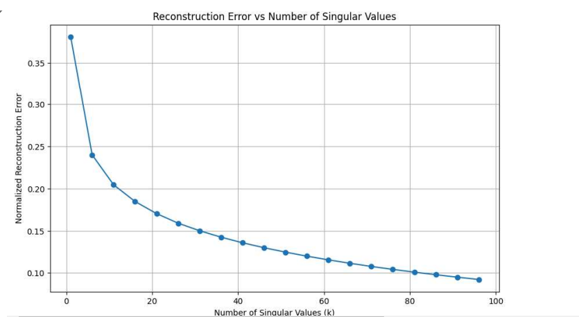
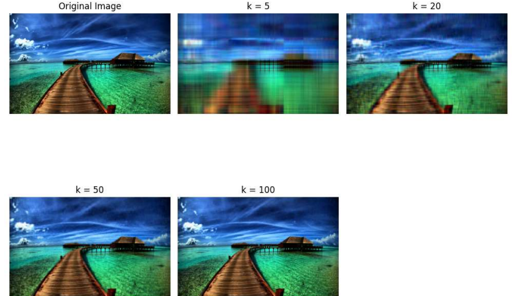
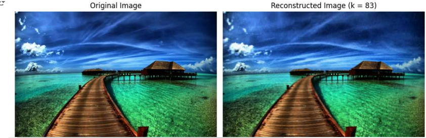

# High-Quality-Image-Video-Compression-SVD

This repository contains a Python implementation of image and video compression using the Singular Value Decomposition (SVD) algorithm. The project focuses on compressing images and videos while retaining the maximum possible quality, and explores the trade-off between the number of singular values used and the quality of the reconstructed media.

## Introduction
This project presents the results of two problems solved using Singular Value Decomposition (SVD). The first problem involves image compression, and the second problem involves video compression using SVD. Both results are presented along with relevant metrics, calculations, and visualizations.

## Image Compression using SVD

### Overview
In this problem, SVD was applied to compress an image by retaining a selected number of singular values, thereby reducing storage requirements while maintaining the quality of the image as much as possible. The primary objective was to achieve a balance between image quality and compression efficiency.

### Methodology
The original image was represented as a matrix $A$ of size $M \times N$. Singular Value Decomposition was applied to decompose $A$ into three matrices:

$$A = U \Sigma V^T$$

where $U$ and $V^T$ are orthogonal matrices, and $\Sigma$ is a diagonal matrix containing the singular values of $A$ in descending order.

To compress the image, only the top $k$ singular values were retained, along with their corresponding vectors in $U$ and $V^T$. This reduced the storage requirement from $M \times N$ to $(M + N) \times k$.

### Results
The original image was decomposed into its singular values, and the top singular values were used to reconstruct the image. The reconstructed image retained most of the significant visual features while significantly reducing the amount of data.

At $k = 83$, the reconstruction satisfied the given threshold error, indicating that the compressed image achieved an acceptable level of quality with minimal data. Specifically, the error threshold was set based on the Frobenius norm between the original and the reconstructed image.

The Frobenius norm of the error was calculated as follows:

$$\text{Error} = \| A - A_k \|_F$$

where $A_k$ is the reconstructed image using the top $k$ singular values.

### Compression Percentage
The compression percentage was calculated as follows:

$$
\text{Compression Percentage} = \left( 1 - \frac{\text{Number of Elements After Compression}}{\text{Number of Elements in Original Image}} \right) \times 100
$$

For $k = 83$, the calculated compression percentage was approximately **889.43%**, demonstrating a significant reduction in data while preserving image quality.

### Plots
- **Figure 1**: Reconstruction error vs Number of singular values.
  
- **Figure 2**: Images at different $k$ values.
  
- **Figure 3**: Comparison between the original image and the compressed image using SVD.
  

### Conclusion
The application of Singular Value Decomposition (SVD) to image compression effectively demonstrated the balance between reducing storage requirements and maintaining image quality. By retaining only the top $k$ singular values, the compressed image was able to preserve most of the significant visual features while significantly decreasing the data storage. The calculated compression percentage of approximately **889.43%** highlights the significant reduction in data storage while still maintaining acceptable quality.

## Video Compression using SVD

The video is represented as a sequence of frames, where each frame is a matrix with dimensions corresponding to the height, width, and number of color channels (e.g., RGB). SVD was applied to each frame in the video, decomposing it into three matrices.

To compress the video, only the top $k$ singular values were retained for each frame, reducing the storage requirement from $M \times N$ to $(M + N) \times k$.

### Compression Percentage
For example, for a video with a compression rank of $k = 50$, the compression percentage achieved was approximately **101.67%**.

### Results
The video was reconstructed using the top $k$ (where $k$ is 11 in our case), singular values for each frame. The reconstructed video retained most of the significant visual information while achieving a high compression percentage.

### Videos
- **Original Video**: The original video can be viewed at the following link: [Watch Original Video](https://drive.google.com/file/d/1u3is24ES0yTCQ0BaHzj4XMupoEylbVl0/view?usp=sharing)
- **Reconstructed Video**: The reconstructed video can be viewed at the following link: [Watch Reconstructed Video](https://drive.google.com/file/d/1u3is24ES0yTCQ0BaHzj4XMupoEylbVl0/view?usp=sharing)

### Conclusion
The use of Singular Value Decomposition (SVD) for video compression successfully reduced storage requirements while maintaining acceptable video quality. By retaining only the top $k$ singular values in each frame, the method achieves efficient compression with minimal loss of essential visual information. For $k = 11$, the compression percentage of **191.67%** was achieved, indicating a substantial reduction in data.
